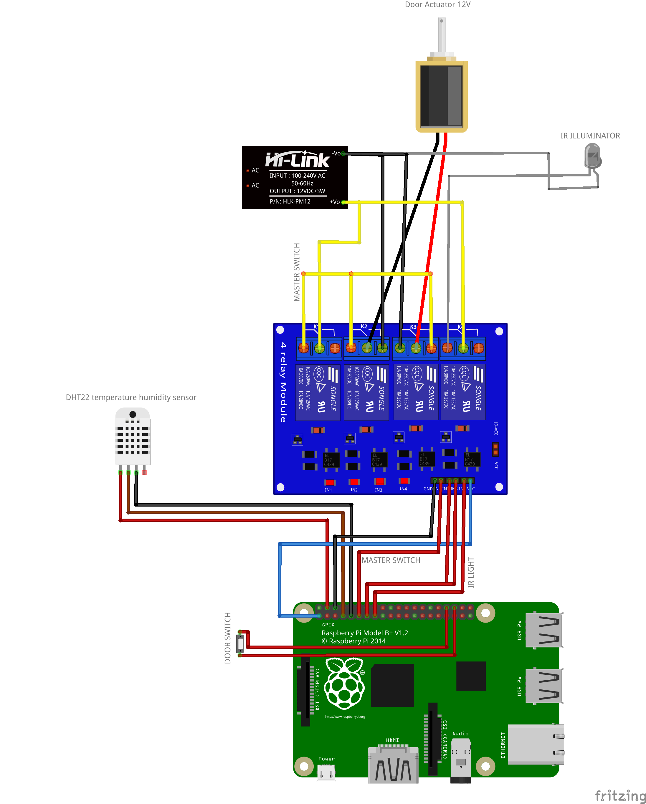

# Chicken Coop

Chicken Coop python app running on Raspberry PI.

Supports:

- capturing temperature using DHT22
- controlling actuator relay for opening/closing door
- streaming mjpg video using official camera module
- streaming audio using USB sound card using external icecast+darkice services
- controlling IR illuminator relay for night vision
- reading input button, if you want to open/close door manually on-site without
  a smart phone
- stores the current state into config file so the door remain in position
  in case of power shortage

The app is split in two parts:

- the *backend* controls the GPIOs (relays, temperature readings, button)
- the *frontend* serves a website and captures video from the camera

## Scheme



## Installation

### Backend

Install dependencies:

```sh
sudo apt install python3-libgpiod # also installs libgpiod2
pip install adafruit-circuitpython-dht
```

Run backend with

```shell
cd backend
python chickencoop_backend.py
```

### Frontend

Run frontend with

```shell
cd backend
python chickencoop_frontend.py
```

Visit [http://your-raspberry-address:8080](http://your-raspberry-address:8080).


### Systemd services

You can register chickencoop to start when raspberry turns on. Put those in
`/etc/systemd/system/chickencoop_{frontend,backend}` respectively.

```
[Unit]
Description=Chicken Coop Frontend
After=network.target

[Service]
ExecStart=/home/pi/chickencoop/frontend/chickencoop_frontend.py
WorkingDirectory=/home/pi/chickencoop/frontend
User=pi
Restart=always
Type=exec

[Install]
WantedBy=default.target
RequiredBy=network.target
```

```
[Unit]
Description=Chicken Coop Backend
After=network.target

[Service]
ExecStart=/home/pi/chickencoop/backend/chickencoop_backend.py
WorkingDirectory=/home/pi/chickencoop/backend
User=pi
Restart=always
Type=exec

[Install]
WantedBy=default.target
RequiredBy=network.target
```

Don't forget to enable them so that they are executed on startup:

```shell
sudo systemctl enable chickencoop_frontend
sudo systemctl enable chickencoop_backend
```

Check logs by:

```shell
sudo journalctl -u chickencoop_frontend
sudo journalctl -u chickencoop_backend
```
